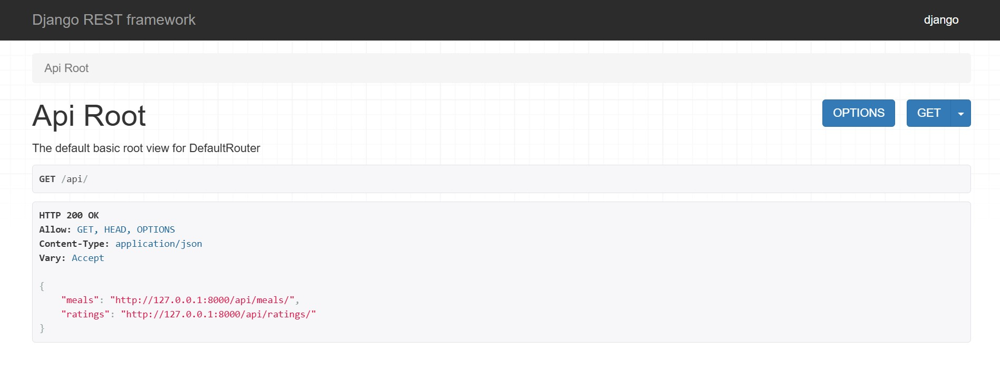

# 🍽️ RatingMealAPI - Meal Rating System

A robust Django REST API for rating and managing meals, perfect for restaurant review apps, meal planning tools, or any system where users need to rate food items.




## ✨ Features

- **Meal Management**: Create, read, update, and delete meals with detailed descriptions
- **Rating System**: Users can rate meals from 1 to 5 stars
- **Smart Constraints**: One rating per user per meal (prevents duplicate ratings)
- **Real-time Statistics**: Automatic calculation of average ratings and rating counts
- **RESTful API**: Clean, intuitive API endpoints using Django REST Framework
- **Admin Interface**: Built-in Django admin panel for easy management
- **Optimized Performance**: Database indexes on key fields for faster queries

## 📋 Table of Contents

- [Installation](#installation)
- [API Endpoints](#api-endpoints)
- [Data Models](#data-models)
- [Usage Examples](#usage-examples)
- [Configuration](#configuration)
- [Contributing](#contributing)

## 🚀 Installation

### Prerequisites

- Python 3.8 or higher
- pip package manager
- Virtual environment (recommended)

### Setup Steps

1. **Clone the repository**
   ```bash
   git clone https://github.com/badawy20oct/RatingMealAPI_Django.git
   cd RatingMealAPI
   ```

2. **Create and activate virtual environment**
   ```bash
   python -m venv venv
   
   # On Windows
   venv\Scripts\activate
   
   # On macOS/Linux
   source venv/bin/activate
   ```

3. **Install dependencies**
   ```bash
   pip install -r requirements.txt
   ```

4. **Run migrations**
   ```bash
   python manage.py migrate
   ```

5. **Create a superuser**
   ```bash
   python manage.py createsuperuser
   ```

6. **Start the development server**
   ```bash
   python manage.py runserver
   ```

The API will be available at `http://localhost:8000/`

## 📡 API Endpoints

### Meals

| Method | Endpoint | Description |
|--------|----------|-------------|
| GET | `/api/meals/` | List all meals |
| POST | `/api/meals/` | Create a new meal |
| GET | `/api/meals/{id}/` | Retrieve a specific meal |
| PUT | `/api/meals/{id}/` | Update a meal |
| PATCH | `/api/meals/{id}/` | Partially update a meal |
| DELETE | `/api/meals/{id}/` | Delete a meal |

### Ratings

| Method | Endpoint | Description |
|--------|----------|-------------|
| GET | `/api/ratings/` | List all ratings |
| POST | `/api/ratings/` | Create a new rating |
| GET | `/api/ratings/{id}/` | Retrieve a specific rating |
| PUT | `/api/ratings/{id}/` | Update a rating |
| PATCH | `/api/ratings/{id}/` | Partially update a rating |
| DELETE | `/api/ratings/{id}/` | Delete a rating |

### Admin Panel

Access the Django admin interface at: `http://localhost:8000/admin/`

## 🗄️ Data Models

### Meal Model

```python
{
    "id": 1,
    "title": "Pizza Margherita",           # Max 32 characters
    "description": "Classic Italian...",    # Max 360 characters
    "number_of_ratings": 15,               # Auto-calculated
    "average_rating": 4.5                  # Auto-calculated
}
```

**Fields:**
- `title` (CharField): Meal name, max 32 characters
- `description` (TextField): Meal description, max 360 characters
- `number_of_ratings` (Computed): Total count of ratings
- `average_rating` (Computed): Average of all ratings (1-5)

### Rating Model

```python
{
    "id": 1,
    "meal": 1,        # Foreign Key to Meal
    "user": 2,        # Foreign Key to User
    "stars": 5        # Integer between 1-5
}
```

**Fields:**
- `meal` (ForeignKey): Reference to the rated meal
- `user` (ForeignKey): Reference to the user who rated
- `stars` (IntegerField): Rating value (1-5)

**Constraints:**
- Unique constraint on `(user, meal)` pair
- Prevents users from rating the same meal multiple times

## 💡 Usage Examples

### Create a Meal

```bash
curl -X POST http://localhost:8000/api/meals/ \
  -H "Content-Type: application/json" \
  -d '{
    "title": "Spaghetti Carbonara",
    "description": "Traditional Italian pasta with eggs, cheese, and bacon"
  }'
```

### Rate a Meal

```bash
curl -X POST http://localhost:8000/api/ratings/ \
  -H "Content-Type: application/json" \
  -H "Authorization: Token YOUR_AUTH_TOKEN" \
  -d '{
    "meal": 1,
    "stars": 5
  }'
```

### Get All Meals with Ratings

```bash
curl http://localhost:8000/api/meals/
```

**Response:**
```json
[
  {
    "id": 1,
    "title": "Spaghetti Carbonara",
    "description": "Traditional Italian pasta with eggs, cheese, and bacon",
    "number_of_ratings": 12,
    "average_rating": 4.7
  }
]
```

## ⚙️ Configuration

### Database

The project uses SQLite by default (`db.sqlite3`). To use a different database, update `settings.py`:

```python
DATABASES = {
    'default': {
        'ENGINE': 'django.db.backends.postgresql',
        'NAME': 'your_db_name',
        'USER': 'your_db_user',
        'PASSWORD': 'your_password',
        'HOST': 'localhost',
        'PORT': '5432',
    }
}
```

### Performance Optimization

The models include database indexes on frequently queried fields:
- `user` field in Rating model
- `meal` field in Rating model

## 🛠️ Tech Stack

- **Backend Framework**: Django 5.2.3
- **API Framework**: Django REST Framework
- **Database**: SQLite (default)
- **Authentication**: Django's built-in User model
- **Admin Interface**: Django Admin

## 🎯 Use Cases

- Restaurant review applications
- Meal planning and rating tools
- Food delivery app rating systems
- Recipe sharing platforms
- Cafeteria feedback systems
- Cooking competition voting systems

## 🤝 Contributing

Contributions are welcome! Please follow these steps:

1. Fork the repository
2. Create a new branch (`git checkout -b feature/AmazingFeature`)
3. Commit your changes (`git commit -m 'Add some AmazingFeature'`)
4. Push to the branch (`git push origin feature/AmazingFeature`)
5. Open a Pull Request

## 📝 License

This project is licensed under the MIT License - see the [LICENSE](LICENSE) file for details.

## 👤 Author

**Abdelrahman Badawy**
- GitHub: [@badawy20oct](https://github.com/badawy20oct)
- Email: badawy20ocy@gmail.com

## 🙏 Acknowledgments

- Django Software Foundation
- Django REST Framework team
- All contributors who help improve this project

---

⭐ If you find this project useful, please consider giving it a star on GitHub!
